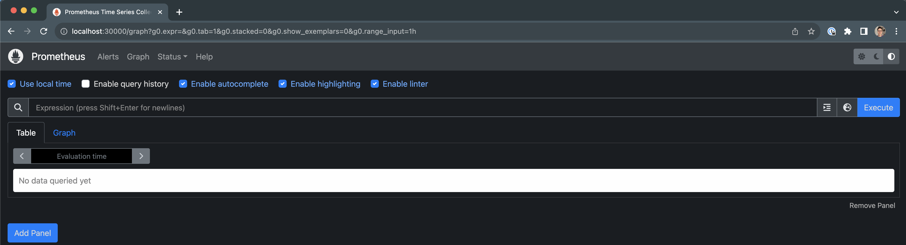

# 

### Prerequisites:

- Docker - https://www.docker.com/get-started/
- Kubernetes - https://kubernetes.io/docs/tasks/tools/
- Kind - https://kind.sigs.k8s.io/docs/user/quick-start/#installing-with-a-package-manager

## 1. Creating a Local Kubernetes Cluster with Kind

Kind is a tool for running local Kubernetes clusters using Docker container "nodes". We will leverage its architecture to deploy some containers to work as a multi-node Kubernetes cluster following the configuration file `kind-config.yaml`. 

In our scenario, we want to have a cluster with different resource sizes and limits. A default container created would have approx. `6 cpu`, `8gb` (memory) and `60gb` (ephemeral storage). To determine the size of the nodes, we can create the cluster patching the kubelet configuration designating a specific amount of resources for the system in each node. The purpose of this is that changing the quantity of system-reserved resources, we are changing the quantity of allocatable amount of resources that are available for pods. For example, designating `2 cpu` for the system, our container will have `4 cpu` available for pods. For more details on this topic, check https://kubernetes.io/docs/tasks/administer-cluster/reserve-compute-resources/

For this exercise, the configuration has one control plane node with 4 workers, defined as:

- 4 cpu, 2 GB ram, 9 GB disk
- 2 cpu, 6 GB ram, 10 GB disk
- 2 cpu, 2 GB ram, 40 GB disk
- 3 cpu, 4 gb ram, 25 GB disk

To deploy it, run the following command in the root of this repository:

```
$ kind create cluster --config kind-config.yaml --name multi-node-cluster
```

Run the following to check the nodes availability:

```
$ kubectl get nodes

NAME                               STATUS   ROLES           AGE   VERSION
multi-node-cluster-control-plane   Ready    control-plane   53s   v1.27.3
multi-node-cluster-worker          Ready    <none>          30s   v1.27.3
multi-node-cluster-worker2         Ready    <none>          30s   v1.27.3
multi-node-cluster-worker3         Ready    <none>          30s   v1.27.3
multi-node-cluster-worker4         Ready    <none>          30s   v1.27.3
```

Also notice that the first node has the Allocatable resources as expected:

```
$ kubectl describe node test-multi-cluster-worker | grep Allocatable: -A 5

Allocatable:
  cpu:                4
  ephemeral-storage:  8773444Ki
  hugepages-2Mi:      0
  memory:             1756188Ki
  pods:               110
```

## 2. Setup Prometheus Monitoring in the K8S Cluster

After running the desired jobs, we want to be able to monitor some metrics, which can be done using Prometheus. Prometheus is a high-scalable open-source monitoring framework. It provides out-of-the-box monitoring capabilities for Kubernetes. Also, In the observability space, it is gaining huge popularity as it helps with metrics and alerts.

First, we need to create a namespace to isolate resources related to monitoring:

```
$ kubectl create namespace monitoring
```

Prometheus related resources are available under `monitoring/prometheus-deploy` director, so we proceed deploying them:

```
$ cd monitoring/prometheus-deploy
$ kubectl create -f prometheus-clusterrole.yaml
$ kubectl create -f prometheus-configmap.yaml
$ kubectl create -f prometheus-deployment.yaml
```

Prometheus will run as an application pod under monitoring namespace. The `prometheus-deployment` will mount the configmap as Prometheus configuration inside `/etc/prometheus`. We can check the created deployment becoming available with:

```
$ kubectl get deployments --namespace=monitoring -w

NAME                    READY   UP-TO-DATE   AVAILABLE   AGE
prometheus-deployment   0/1     1            0           10s
prometheus-deployment   1/1     1            1           20s
```

From here, we have several ways to access the prometheus server. We could port-forward the pod and leverage it, but we are going to deploy a service and access it by node port 3000, so we don't need to port-forward anything and access the server from local machine:

```
$ kubectl create -f prometheus-service.yaml --namespace=monitoring
```

Then we can go to `http://localhost:30000/` in the browser:



### kube-state-metrics

For some queries in Prometheus, we will need the kube-state-metrics service. It talks to the Kubernetes API server to get all the details about all the API objects like deployments, pods, daemonsets, Statefulsets, etc.

First, we need to clone the github repo:

```
$ git clone https://github.com/devopscube/kube-state-metrics-configs.git
```

And proceed creating all objects related to kube-state-metrics:

```
$ kubectl apply -f kube-state-metrics-configs/
```

## 3. Create a Custom Scheduler

Now that we have a functional K8s cluster and a monitoring service, we can proceed to deploy a custom scheduler. The first step is to package the scheduler binary into a container image to be consumed as a deployment in the cluster. This step is described here: https://kubernetes.io/docs/tasks/extend-kubernetes/configure-multiple-schedulers/#package-the-scheduler, so it would be redundant to have it in this document. In addition, the binary was uploaded to my docker hub repository under `docker.io/muriloschuck/my-scheduler:2.0`, so it's not essential.

The `my-scheduler-config` ConfigMap stores the configuration file inside `my-scheduler.yaml`. The Pod of `my-scheduler` Deployment mounts the `my-scheduler-config` ConfigMap as a volume. The custom scheduler in this repository will modify the weight of node resources to act differently from the default scheduler.

Create the scheduler deployment:

```
$ kubectl create -f my-scheduler.yaml
```

Verify the pod running:

```
$ kubectl get pods --namespace=kube-system -w

NAME                                                       READY   STATUS    RESTARTS   AGE
.
.
.
my-scheduler-6546c4d69f-nx8h2                              0/1     Running   0          20s
my-scheduler-6546c4d69f-nx8h2                              1/1     Running   0          40s
```

## 4. Create Jobs

With all the environment setup done, we can proceed to deploy jobs and let the scheduler work. The script `spawn_jobs.sh` is responsible for creating multiple jobs and deploy them at the same time. The jobs have hardcoded values, but it should be easily configurable to determine the amount of resources to be stressed in each job as the logic is based in the function `create_job()`. 

Also, notice that the job base is the Pod yaml `job-template.yaml`, which already defined the `schedulerName` as `my-scheduler`.

Proceed creating a namespace for the jobs runs:

```
$ kubectl create namespace run-job
```

Then run the script:

```
$ ./spawn_jobs.sh
```

The pods will be deployed. After the jobs are done, you may see that they keep in `COMPLETED` state, so you can proceed and clean them using the `clean_jobs.sh`:

```
$ kubectl -n run-job get pods
NAME          READY   STATUS      RESTARTS   AGE
workload-1    0/1     Completed   0          5m7s
workload-10   0/1     Completed   0          5m7s
workload-2    0/1     Completed   0          5m7s
workload-3    0/1     Completed   0          5m7s
workload-4    0/1     Completed   0          5m7s
workload-5    0/1     Completed   0          5m7s
workload-6    0/1     Completed   0          5m7s
workload-7    0/1     Completed   0          5m7s
workload-8    0/1     Completed   0          5m7s
workload-9    0/1     Completed   0          5m7s

$ ./clean_jobs.sh workload
[INFO] Cleaning job pods
pod "workload-1" deleted
pod "workload-10" deleted
pod "workload-2" deleted
pod "workload-3" deleted
pod "workload-4" deleted
pod "workload-5" deleted
pod "workload-6" deleted
pod "workload-7" deleted
pod "workload-8" deleted
pod "workload-9" deleted
```